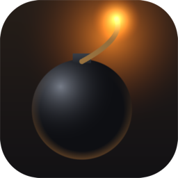
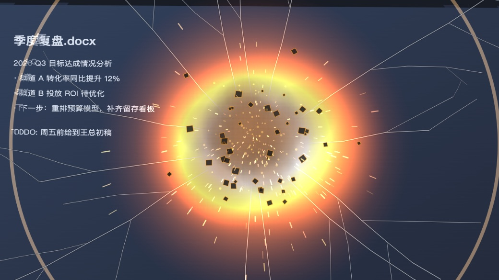
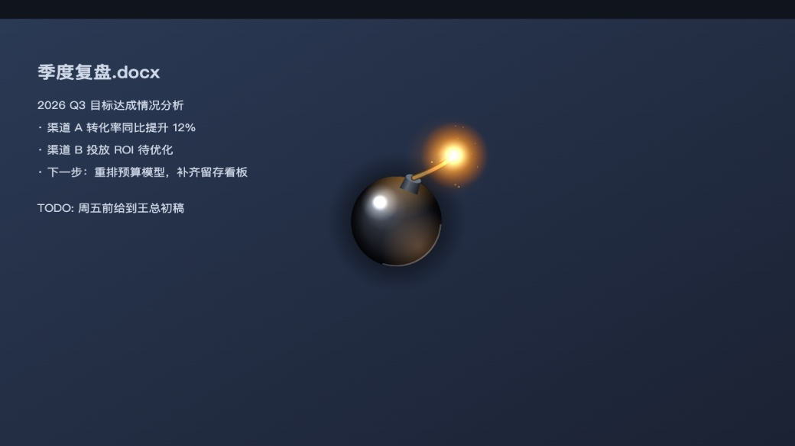
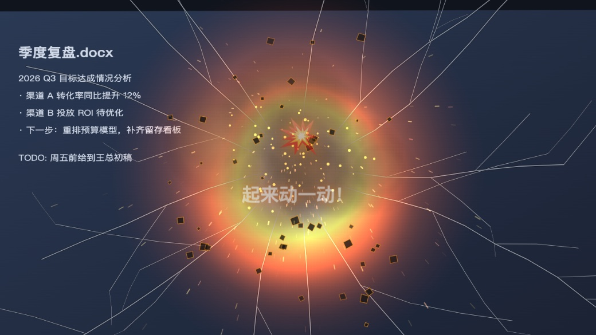
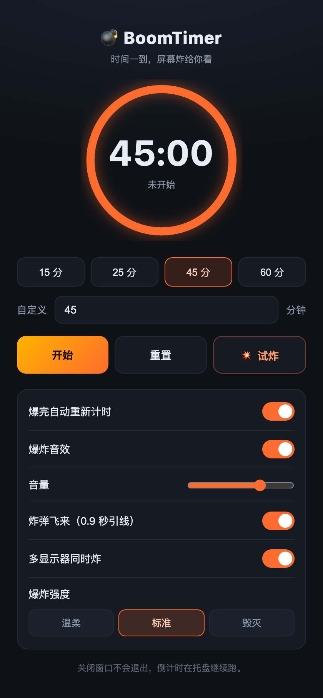

<div align="center">



# BoomTimer

### 时间一到，屏幕炸给你看

久坐提醒总是被顺手点掉？那就让它没法被忽略。

[](https://github.com/Suzzt/boom-timer/releases/latest)




</div>

<br>

## 这是什么

一个会爆炸的定时器。

久坐一小时该起来活动，这件事人人都知道，但常规的提醒——弹个通知、响一声——你看一眼就点掉了，屁股还在椅子上。

BoomTimer 换了个思路：**倒计时结束时，一颗炸弹从屏幕正中央由远及近飞来，然后炸开，整块屏幕跟着抖三抖。**

你没法忽略它。而且大概会笑一下。笑完就起来动动吧。

<br>

## 看看效果

<table>
<tr>
<td width="33%"></td>
<td width="33%"></td>
<td width="33%"></td>
</tr>
<tr>
<td align="center"><b>① 炸弹飞来</b><br><sub>3D 炸弹由远及近，引线滋滋作响</sub></td>
<td align="center"><b>② 引爆</b><br><sub>火球、冲击波、玻璃裂纹，屏幕剧烈震动</sub></td>
<td align="center"><b>③ 余波</b><br><sub>浓烟散去，提醒你起来动一动</sub></td>
</tr>
</table>

> 整个过程约 3 秒，稳定 60 帧。**浮层全程点击穿透**——爆炸期间你照样能打字、点击、拖窗口，不会打断手上的活。

<br>

## 主要功能

|  | |
| --- | --- |
| ⏱ **倒计时** | 15 / 25 / 45 / 60 分钟预设，也能填任意分钟数 |
| 🔁 **循环模式** | 炸完自动重新计时，当番茄钟用 |
| 💥 **三档强度** | 温柔 / 标准 / 毁灭，震幅、火球、粒子量同步变化 |
| 🔊 **爆炸音效** | 实时合成的低频轰鸣 + 爆裂 + 余震，音量可调 |
| 🖥 **多显示器** | 可开启每块屏同时炸（默认关闭，开了会让主屏帧率略降）|
| 🎯 **托盘常驻** | 关掉窗口倒计时照常跑，托盘里可暂停 / 重置 / 立即引爆 |
| ⌨️ **空格键** | 开始 / 暂停 |

<div align="center">

</div>

<br>

## 安装

**[→ 前往 Releases 下载](https://github.com/Suzzt/boom-timer/releases/latest)**

| 平台 | 文件 | 体积 |
| --- | --- | --- |
| macOS（Apple Silicon） | `BoomTimer_*_aarch64.dmg` | 2.5 MB |
| macOS（Intel） | `BoomTimer_*_x64.dmg` | 2.6 MB |
| Windows | `BoomTimer_*_x64-setup.exe` | 1.4 MB |

装完只占 5.5 MB。之所以能这么小，是因为它用系统自带的浏览器内核，而不是像大多数跨平台应用那样自带一整个 Chrome。

<details>
<summary><b>首次打开被系统拦住了？</b></summary>

<br>

应用没有花钱买商业签名，所以系统会提示来源不明：

- **macOS**：在应用图标上右键 → 打开 → 再点一次「打开」
- **Windows**：SmartScreen 弹窗里点「更多信息」→「仍要运行」

</details>

<details>
<summary><b>macOS 会要「屏幕录制」权限，为什么？</b></summary>

<br>

因为「整块屏幕震动」是靠引爆瞬间抓一张屏幕快照实现的——把快照铺满屏幕再抖它，视觉上就是整个桌面被炸得晃动。这个动作需要屏幕录制权限。

**不给也能用**：会自动降级成半透明浮层，桌面不抖，但火球、裂纹、浓烟照常炸，效果仍然成立。

快照只存在于本机内存和临时文件里，爆炸结束立即删除，不会上传到任何地方。

</details>

<br>

## 怎么用

1. 打开应用，选个时间（默认 45 分钟）
2. 点「开始」，然后该干活了
3. 时间到，屏幕炸给你看
4. 起来走两步，喝口水

想先看看效果，点「试炸」。

<br>

## 常见问题

<details>
<summary><b>爆炸的时候我正在打字怎么办？</b></summary>
<br>
不影响。爆炸浮层是完全点击穿透的，键盘鼠标照常穿过去。唯一的影响是抖动的那 0.7 秒左右屏幕显示的是快照而非实时画面，之后立刻恢复。
</details>

<details>
<summary><b>开会 / 投屏的时候会不会炸出来？</b></summary>
<br>
会。目前<b>还没有</b>「免打扰时段」和「投屏自动静音」功能——这是个已知的短板。要开会之前建议先点「暂停」，或者至少把音效关掉。
</details>

<details>
<summary><b>平时吃性能吗？</b></summary>
<br>
不吃。平时只有一个计时器在跑，界面窗口关掉后连渲染都停了。只在爆炸那 3 秒内才有动画开销。
</details>

<details>
<summary><b>Windows 7 能用吗？</b></summary>
<br>
不能。需要系统的 WebView2 运行时，Windows 10 及以上才有（Win11 自带，Win10 绝大多数机器也已预装）。
</details>

<details>
<summary><b>数据会不会被上传？</b></summary>
<br>
应用完全离线，没有任何联网代码。设置存在本机，屏幕快照用完即删。
</details>

<br>

## 参与开发

```bash
git clone https://github.com/Suzzt/boom-timer.git
cd boom-timer
npm install
npm run dev
```

需要 [Node.js](https://nodejs.org) 和 [Rust](https://rustup.rs)。爆炸动画可以脱离客户端单独调试：

```bash
npm run preview   # 然后打开 http://localhost:5178/_preview.html
```

技术实现、踩过的坑、打包发布流程都记在 **[docs/NOTES.md](docs/NOTES.md)**。

欢迎提 Issue 和 PR。想加功能的话，「免打扰时段」和「自定义提示文案」是目前最需要的两个。

<br>

## License

[MIT](LICENSE)

<br>

<div align="center">
<sub>久坐是慢性自杀，但爆炸很快乐。</sub>
</div>
